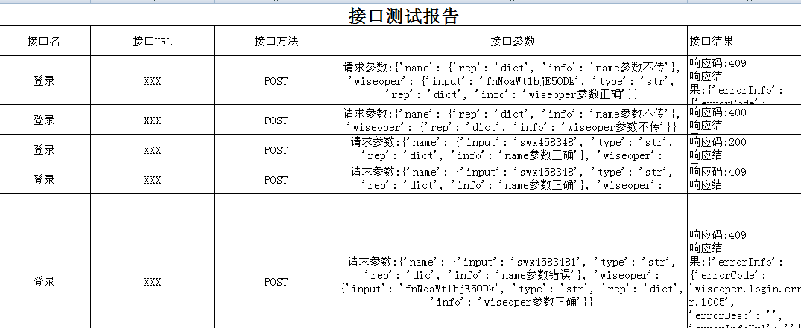

# 说明
全对偶接口生成参数

# 功能 
* python3.4  多线程
* unittest参数化
* objectpage
* 数据维护用的YMAL
* 基于PICT全对偶生成接口参


# 配置


**配置init.yaml**

```
title: XXXX接口测试
host: baidu.com
port: 8443
protocol: https://
header: {account": "XX", "Content-Type": "application/json; charset=UTF-8","secrectKey": "XXX=","appID": "XX"}
```


# 实例-登录


**配置用例yaml**

```
req: 1001|登录|/XX/login|POST
param:
  - name: 0|swx458348|str|rep|dict&1|swx4583481|str|rep|dic&3|rep|dict
  - XX: 0|fnNoaWt1bjE5ODk|str|rep|dict&1|fnNoaWt1bjE5ODk1|str|rep|dic&3|rep|dict
  
#error: 0正常，1错误的值，2类型错误,3不传字段，4后面再扩展如最大，最小
#rep：后面是检查点，支持
#{} ,对应key为Dict
#{[]},对应key为DictList
#{[{},{}]} 对应key为DictListDict

```


**PageObject**

```
class Login:
    '''
    kwargs: 
    path: 用例文件目录
    initPath： 请求头部目录
    '''

    def __init__(self, **kwargs):
        self.path = kwargs["path"]  # 用例yaml目录
        self.param = getYam(self.path)["param"]  # 请求参数
        self.req = getYam(self.path)["req"]  # 请求url
        self.readParam = readParam(self.param)  # 读取并处理请求参数
        pairPatchParam(params=self.readParam, paramPath=PATH("../Log/param.log"),
                       paramRequestPath=PATH("../Log/paramRequest.log"))  # pict生成参数
        self.getParam = readPictParam(paramRequestPath=PATH("../Log/paramRequest.log"))  # 得到pict生成的参数
        self.readReq = readReq(self.req)  # 0 用例id,1 用例介绍,2 url,3 mehtod
        print(self.readReq)
        self.head = requestHead(kwargs["initPath"]) # initPath 请求头准备
        print(self.head)
        # self.head = requestHead(PATH("../yaml/init.yaml"))  # protocol ,header,port,host,title

   # 发送请求
    def request(self, item):
        app = {}
        param = paramsFilter(item)  # 过滤接口,如果有其他加密，可以自行扩展
        print(param)
        f = request(header=self.head["header"], host=self.head["host"], protocol=self.head["protocol"],
                    port=self.head["port"])
        app["url"] = self.readReq[2]
        app["param"] = writeResultParam(item)
        app["method"] = self.readReq[3]
        if self.readReq[3] == "POST":
            app["result"] = f.post(self.readReq[2], param=param)
        else:
            app["result"] = f.get(self.readReq[2], param=param)
        self.data.append(app)

    def operate(self, path):
        '''
        发请求
        :param path: 统计的path
        :return: 
        '''
        threads = []
        for item in range(len(self.getParam)):
            threads.append(BThread(self.request(self.getParam[item])))
        for j in range(len(self.getParam)):
            threads[j].start()
        for k in range(len(self.getParam)):
            threads[k].join())

```


**test**

```
from PageObject.PageLogin import Login

PATH = lambda p: os.path.abspath(
    os.path.join(os.path.dirname(__file__), p)
)


class LoginTest(unittest.TestCase):

    def testLogin(self):
        login = Login(path=PATH("../yaml/login.yaml"), initPath=PATH("../yaml/init.yaml"))
        login.operate()
)

```


# 代码入口实例

```
from Base.BaseRunner import ParametrizedTestCase
from test.TestLogin import LoginTest

def runnerCase():
    starttime = datetime.now()
    suite = unittest.TestSuite()
    suite.addTest(ParametrizedTestCase.parametrize(LoginTest))
    unittest.TextTestRunner(verbosity=2).run(suite)
    endtime = datetime.now()
if __name__ == '__main__':
    runnerCase()
```


# 结果执行过程1 

```
https://XXX post接口参数为:...
Task ret: {'status_code': 409}
https://XXX post接口参数为:{}
{'status_code': 400}
Task ret: {'status_code': 400}
https://XXX/login post接口参数为:....
{'status_code': 200, 'resultCode': 0, 'info': 'Success', '...
https:/...r/login post接口参数为:{'name': 'XXX', 'pwd': 'XXX'}
{'status_code': 409}
......

```




# 其他
* 后续加上检查点的检查


